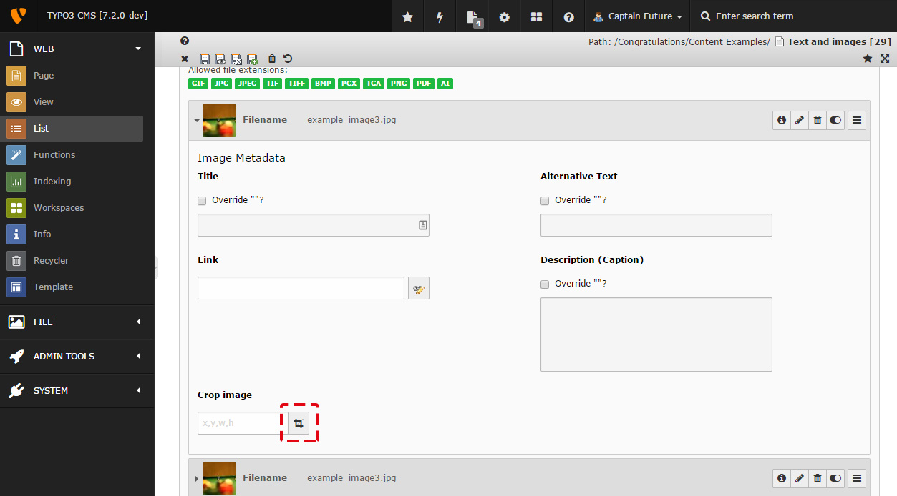
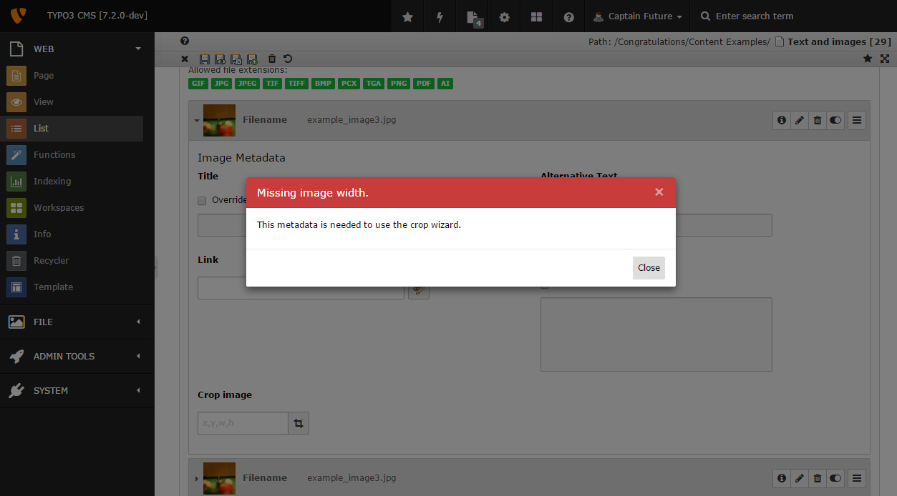
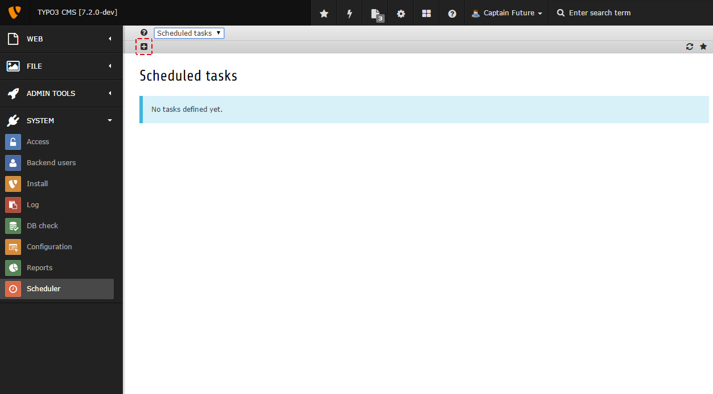
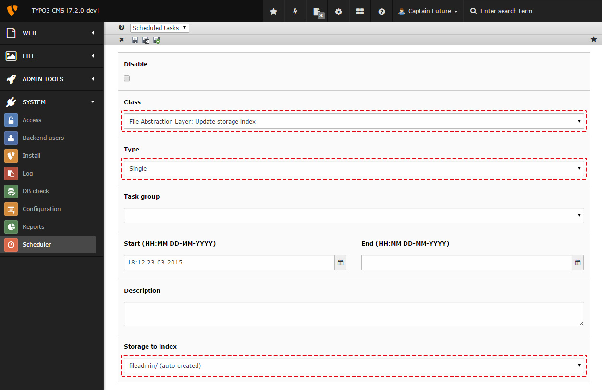
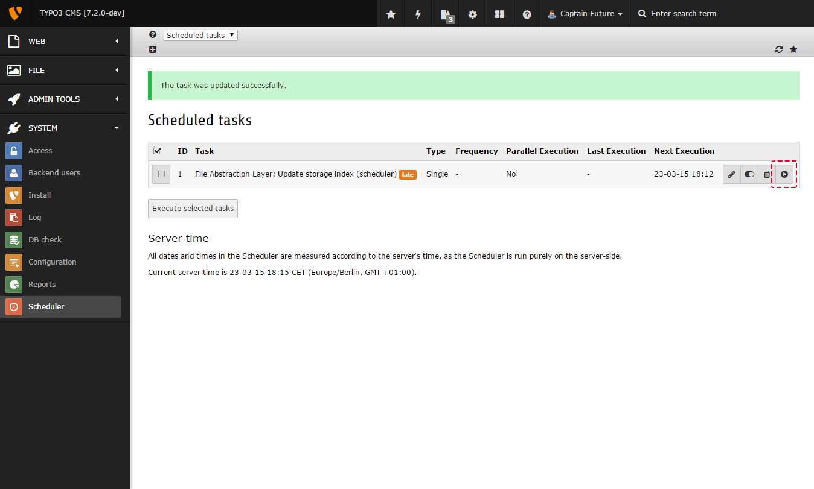

.. include:: /Includes.rst.txt

==========================
TYPO3 Exception 1427190270
==========================

.. note::
If you encountered this exception, please help others by providing
information about how you got this error. Especially if you have a solution,
please add it to this page by following the :ref:`"Edit on GitHub" workflow
<docs-contribute-github-method>`!

Errors Messages for Image Cropper.
==================================

Missing Metadata
----------------

How you got the error
^^^^^^^^^^^^^^^^^^^^^

When using the image cropper :

.. container::

   |Screenshot : using image cropper|

| 
| You might encounter the following error message :

.. container::

   |Screenshot : Missing Metadata Error|

| 

How to solve it
^^^^^^^^^^^^^^^

| Go to the Schelduler as shown in the following image.
| Note that if you have already defined task, such as "File Abstraction
  Layer : Update Storage index", you should jump to step :"run
  schelduler"

.. container::

   |Screenshot : Schelduler main page|

| 
| Create a new task by clicking on the "+" as shown in the following
  image :

.. container::

   |Screenshot : Creating a new task|

| 
| Once the Task Form opens, fill it as follow:

.. container::

   |Screenshot : Task Setting|

| 
| Save the task by clicking on the floppy icon, tick the leftside
  checkbox, and clic the "execute selected task" button:

.. container::

   |image1|

| 
| If you have a lot of files in FAL, indexing may take some time. once
  indexing finishes, get back to image cropping, all should be fine now.

.. |Screenshot : Schelduler main page| image:: files/01-scheduler-open.jpg

