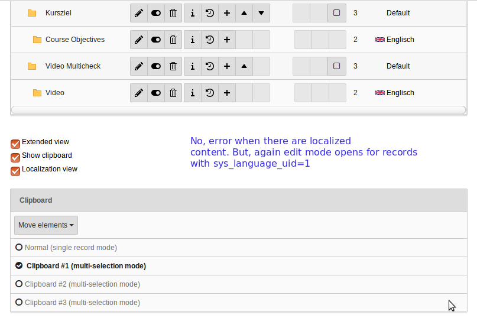

.. include:: /Includes.rst.txt

==========================
TYPO3 Exception 1437656456
==========================

.. include:: /If-you-encounter-this-exception.rst.txt

I received this exception under Typo3 7.6.9 when attempting to add the
language ISO code to a language with the ID "0". It worked fine for the
second language which was ID "1". Our TYPO3 is running on MySQL 5.5 and
PHP 5.6. I tried clearing all caches in the Install tool and also
setting the ISO code in the database table sys_language to 'de' for the
language. It might be possible to simply change the ID to a positive
integer value but then TYPO3 would probably not find the corresponding
content.

I confirm, this issue is present in TYPO3 8.7.1 too. We have a
multi-lingual setup running on TYPO3 8.7.1. Now, when translated records
are present, then we do not face TYPO3 error, but only the localized
records (sys_language_uid=1 in our case) open in multiple edit mode. We
cannnot switch to "Default" language. If no translated records present,
we see the TYPO3 error. This is a very important feature of TYPO3 and
used by many BE Editors. Please check and fix the bugs!

.. container::

   .. container::

      |TYPO3 multi-content edit error.png|

      .. container::

         .. container::

::

   ================ This is a gridelement introduced bug =============

I like to throw lights on this further. This issue is not related to
TYPO3 core, but gridelement extension! The extension is XCLASSing the
class \\TYPO3\CMS\Recordlist\RecordList\DatabaseRecordList. And while
doing it, instead of using "$currentContainerIdList[] = $row['uid'];",
it used the code $this->currentContainerIdList[] = $row['uid']; This
makes the array $currentContainerIdList empty, which is passed to the
call $out .= $this->renderListHeader($table, $currentIdList);

I wonder if that is still correct as gridelements does not contain $out
.= $this->renderListHeader($table, $currentIdList); but $out .=
$this->renderListHeader($table, $this->currentIdList); (ver 7.2.0).
Maybe that has been fixed. I don't find a bug report though.

---

Happens to me in TYPO3 7.6.24 when creating a new Page. Created a
Bug-Ticket: https://forge.typo3.org/issues/83994

---

The issue was solved here by comparing the database with the
specification (see install tool > important actions). Make sure your
table definitions are the same as they are in the current database!

