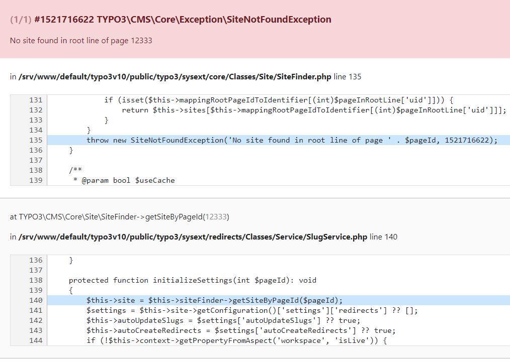

.. include:: /Includes.rst.txt

==========================
TYPO3 Exception 1521716622
==========================

.. include:: /If-you-encounter-this-exception.rst.txt

.. container::

   .. container::

      |Error-message.png|

      .. container::

         .. container::

When a page of type shortcut with external URL is created the slug that
is automatically created looks like this: "/https//wwwfacebookcom/...".

Changing this slug to something like "/my-company" is raising the
error-message shown on the screenshot.

